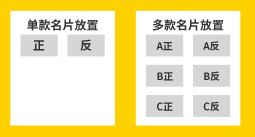

## ● 300克铜版纸名片报价下单

【注意】不提供设计服务，只提供印刷服务，请自行提供设计好的成品

## ● 名片报价无工艺

**名片标准尺寸：**横板：90 X 54 mm __ 竖版：54  X 90 mm  

|    工艺    | 200张 | 500张 | 1000张 | 2000张 | 5000张 | 1万张 |
| :--------: | :---: | ----- | :----: | :----: | :----: | :---: |
| **不覆膜** |  9.5  | 13.5  |  19.5  |  31.5  |  80.1  | 153.2 |
| **覆哑膜** | 10.6  | 14.7  |  21.9  |  38.7  |  98.1  | 186.6 |

偏远地区不包邮，联系客服实时报价。

## ● 名片工艺附加报价

工艺价格需要单独支付，附加工艺报价需名片印刷价格+工艺价格

**比如：200张不覆膜切圆角【9.5+2.2=11.7】**

|    工艺     | 200张 | 500张 | 1千张 | 2千张 | 5千张 | 1万张 |
| :---------: | :---: | :---: | :---: | :---: | :---: | :---: |
|   切圆角    |  2.2  |  5.5  |  11   |  22   |  55   |  110  |
| 一条手撕线  |  2.2  |  5.5  |  11   |  22   |  55   |  110  |
| 打2条流水码 |  22   |  33   |  66   |  132  |  330  |  660  |
|    模切     |  33   |  44   |  66   |  110  |  143  |  198  |

## ● 文件上传地址

**标准名片设计框架样板下载：**https://wwrb.lanzn.com/i2SCt2bwm3ub

**文件上传地址：**https://c.wss.pet/s/du5eccddw9c

1、**文件名**改为收件人名字

2、一人多款，地址相同，文件放到同一文件夹内上传文件夹，

**或者**放到cdr内，左边放正面，右边放反面

## ● 名片尺寸

## ● 名片厚度

## ● 覆膜不覆膜介绍

### 覆哑膜介绍说明

  

### 不覆膜介绍说明

  

## ● 包装演示

### 默认包装（1000张装）

即2个500张装的盒子，依次类推

5000张以上使用纸箱再次打包

### 默认包装（500张装）

### 默认包装（200张装）

