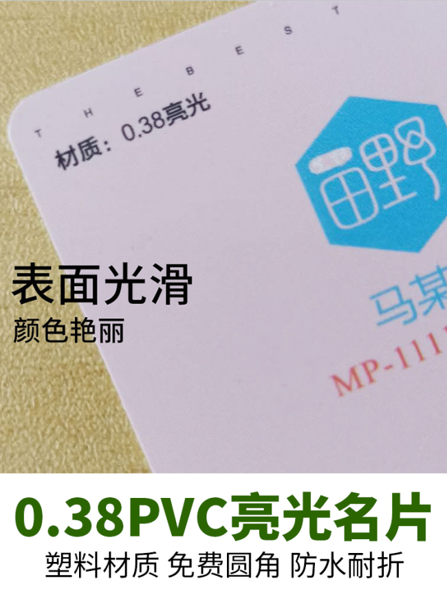
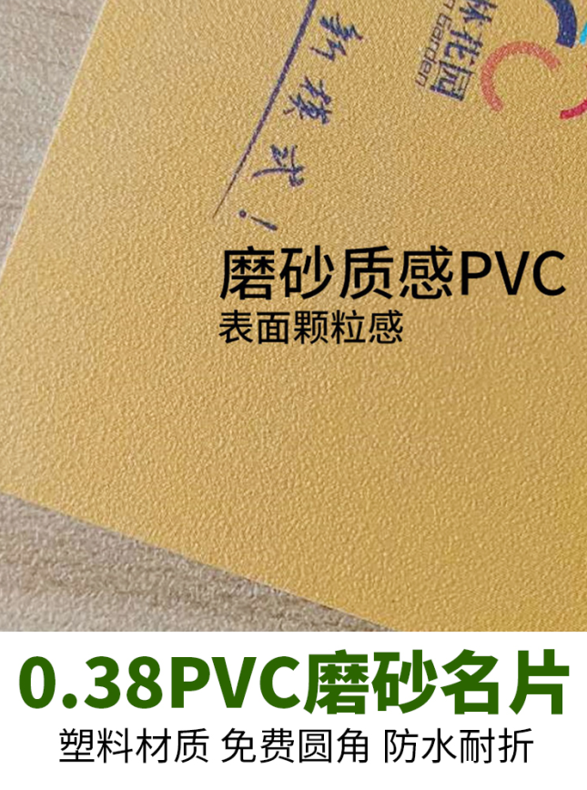
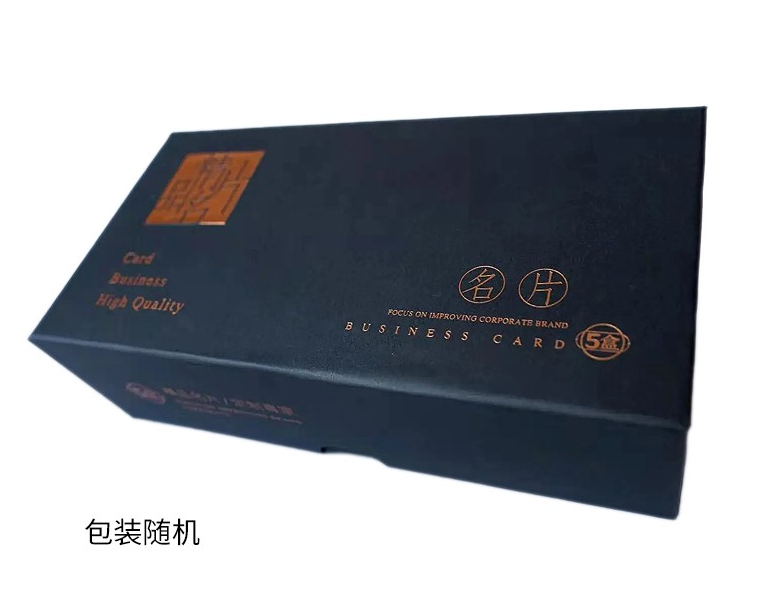

## 1、名片报价无工艺

**名片标准尺寸：**横板：90 X 54 mm __ 竖版：54  X 90 mm  

|      工艺       | 200张 | 500张 | 1000张 | 2000张 | 5000张 | 1万张 |
| :-------------: | :---: | ----- | :----: | :----: | :----: | :---: |
| 0.38pvc亮光名片 |  24   | 39    |   68   |  135   |  315   |  550  |
| 0.38PVC磨砂名片 |  24   | 39    |   68   |  135   |  315   |  550  |

偏远地区不包邮，联系客服实时报价。

**标准名片设计框架样板下载：**https://wwrb.lanzn.com/i2SCt2bwm3ub

## 2、文件上传地址

https://c.wss.pet/s/du5eccddw9c

1、**文件名**改为收件人名字

2、一人多款，地址相同，文件放到同一文件夹内上传文件夹，

**或者**放到cdr内，左边放正面，右边放反面

## 3、工艺说明

### 0.38mm PVC亮光名片

  	

### 0.38mm PVC磨砂名片

  

## 4、包装演示

### 默认包装（1000张装）

**即2个500张装的盒子，依次类推**

200张为小盒，500张为大盒（如图所示），1000张以上以500张大盒为基础进行包装

5000张以上使用纸箱再次打包

