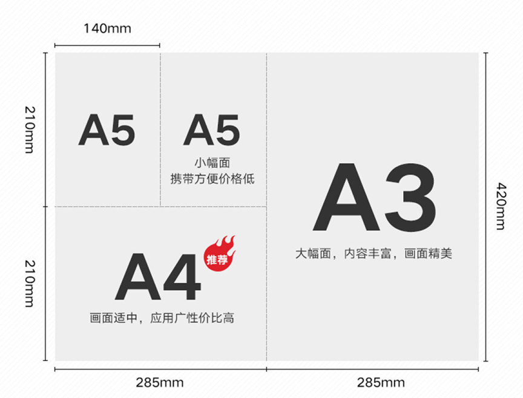
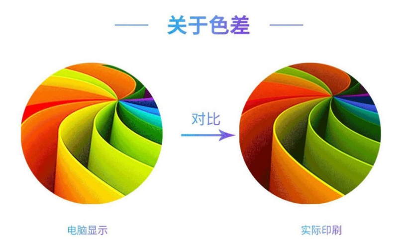

# 1、宣传单报价【湖南仓库】

## 行标157克铜版纸【实际厚度110克】

| 尺寸 | 设计尺寸  | 内容安全距离  | 款数 | 500张 | 1千张 | 2千张 | 3千张 | 5千张 | 1万张 |
| :--: | :-------: | :-----------: | :--: | :---: | :---: | :---: | :---: | :---: | :---: |
|  A5  | 216*146mm | 距设计尺寸8mm |  1   |  26   |  37   |  67   |  99   |  153  |  289  |
|  A4  | 216*291mm | 距设计尺寸8mm |  1   |  48   |  73   |  132  |  197  |  306  |  578  |
|  A3  | 426*291mm | 距设计尺寸8mm |  1   |  96   |  143  |  263  |  393  |  611  | 1154  |

## 加厚157克铜版纸【实际厚度130克】

| 尺寸 | 设计尺寸  | 内容安全距离  | 款数 | 500张 | 1千张 | 2千张 | 3千张 | 5千张 | 1万张 |
| :--: | :-------: | :-----------: | :--: | :---: | :---: | :---: | :---: | :---: | :---: |
|  A5  | 216*146mm | 距设计尺寸8mm |  1   |  28   |  39   |  72   |  108  |  169  |  332  |
|  A4  | 216*291mm | 距设计尺寸8mm |  1   |  51   |  77   |  141  |  215  |  338  |  663  |
|  A3  | 426*291mm | 距设计尺寸8mm |  1   |  101  |  153  |  281  |  427  |  674  | 1326  |

## 国标157克铜版纸【实际厚度150克】

| 尺寸 | 设计尺寸  | 内容安全距离  | 款数 | 500张 | 1千张 | 2千张 | 3千张 | 5千张 | 1万张 |
| :--: | :-------: | :-----------: | :--: | :---: | :---: | :---: | :---: | :---: | :---: |
|  A5  | 216*146mm | 距设计尺寸8mm |  1   |  44   |  64   |  110  |  146  |  232  |  447  |
|  A4  | 216*291mm | 距设计尺寸8mm |  1   |  86   |  127  |  219  |  290  |  463  |  892  |
|  A3  | 426*291mm | 距设计尺寸8mm |  1   |  171  |  252  |  437  |  579  |  925  | 1784  |

## 设计模板下载

**标准单页设计框架样板下载：**https://wwrb.lanzn.com/iMmdl2bwm87i

## 关于尺寸

## 关于色差

