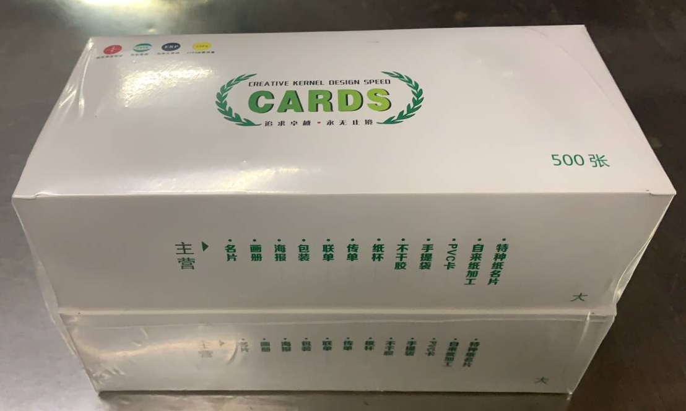
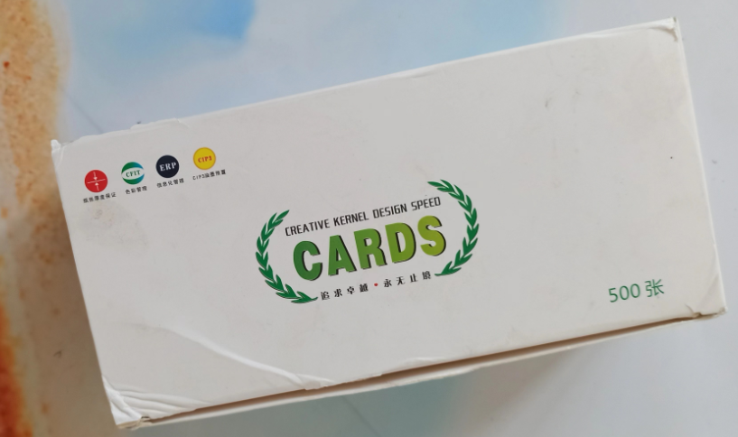
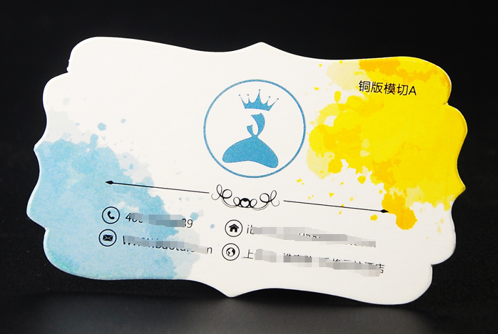

## 1、名片覆膜与不覆膜介绍

### 名片覆膜展示

  

### 名片不覆膜展示

  

## 2、名片包装演示

普通包装与精品包装各有三种类型的包装分别为：200张 / 500张 / 1000张  

**默认普通包装，不支持指定包装类型**  

精品名片、PVC名片默认精品包装（特殊情况除外）

### 精品包装样品（500张装）

### 普通包装（1000张）

### 普通包装（500张装）

### 普通包装（200张装）

## 3、PVC名片样品

pvc名片默认制作圆角

### 0.38mm——PVC磨砂

### 0.38mm——PVC亮光

### 演示视频

这是演示视频

## 铜版纸样品

### 铜版纸不覆膜

### 铜版纸覆膜

### 铜版纸模切

### 铜版纸吊牌

### 铜版纸涂银

